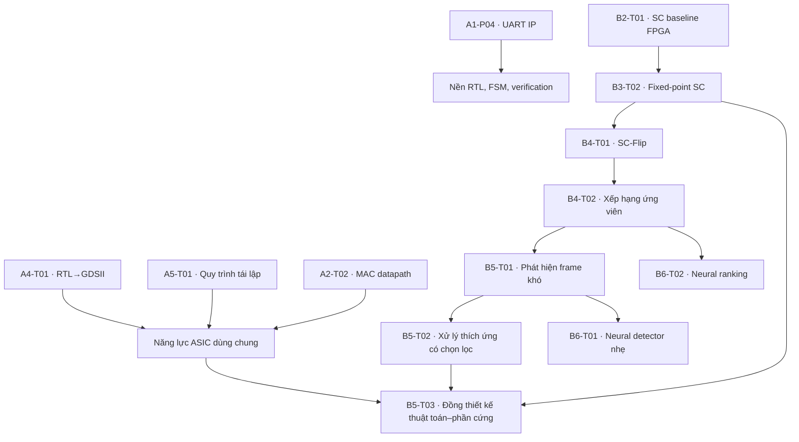

# Vận hành nhóm nghiên cứu theo track

**Engineering & Research Mentoring Program (Lucero)** · ThS. Đinh Văn Nam (Mr. Lucero Dinh) — Khoa Điện–Điện tử, Trường Kỹ thuật, Đại học Phenikaa

Tài liệu này trả lời một câu hỏi rất cụ thể: **một mentor làm sao đồng hành được
mười ba đề tài nghiên cứu cùng lúc mà không kiệt sức và không hạ chuẩn?**

Câu trả lời ngắn: không họp riêng từng đề tài, không sửa lỗi cài đặt hộ, và không
cho qua một cửa nào chỉ vì sinh viên đã cố gắng.

---

## 1. Bốn track, không phải mười ba đề tài rời rạc

| Track | Tên | Vai trò trong hệ thống |
|---|---|---|
| **A** | Thiết kế IC số mã nguồn mở | Tạo năng lực RTL→GDSII dùng lại cho mọi đề tài ASIC phía sau |
| **B** | Kiến trúc phần cứng số | Fixed-point, datapath, pipeline, PPA — nền kỹ thuật cho trục C và D |
| **C** | Kiến trúc bộ giải mã Polar | Từ SC baseline tới SC-Flip: đúng trước, nhanh sau |
| **D** | Giải mã Polar thích ứng / hỗ trợ neural | Chỉ tốn tài nguyên cho frame khó; tiềm năng công bố cao nhất, rủi ro cũng cao nhất |

Track A và B **không phải** track hạng hai. Chúng tạo ra năng lực và công cụ mà track C, D
tiêu thụ. Một nhóm C bị kẹt vì không ai trong phòng lab dựng nổi môi trường tổng hợp là
lỗi của việc bỏ qua track A, không phải lỗi của sinh viên C.

## 2. Phụ thuộc giữa các đề tài

**Không cần đợi đề tài trước xong 100%.** Điều kiện để mở đề tài sau là đề tài trước đã có
**baseline chạy được và được kiểm chứng** — tức là đã qua Gate 2. Danh sách theo đợt nằm ở
`02_Project_Portfolio/Research_Packs/README.md`.

## 3. Quy tắc baseline dùng chung

> Không nhân bản năm phiên bản SC khác nhau cho năm nhóm.

Duy trì **một** golden baseline có tag/version trong một repository chung. Mọi đề tài phía
sau ghi rõ commit hoặc tag của baseline mà nó dùng, trong README và trong mỗi nhật ký thí nghiệm.

Đây không phải chuyện gọn gàng. Nó là điều kiện để so sánh giữa các nhóm còn có nghĩa:
nếu nhóm B4-T01 và nhóm B5-T02 chạy trên hai bản SC khác nhau thì mọi kết luận so sánh
giữa hai đề tài đó đều vô hiệu, và cả hai khóa luận đều mất phần đóng góp mạnh nhất.

## 3b. Còn 92 đề tài còn lại thì vận hành thế nào?

Bốn track ở trên là cách tổ chức **13 đề tài nghiên cứu** đi sâu. Toàn bộ chương trình rộng hơn:
**105 đề tài trong 16 nhóm chuyên môn**, trải bốn mức trưởng thành **P → I → T → R**. Nguyên tắc
gộp vẫn giống hệt — **review theo nhóm, không theo 105 luồng riêng**:

- Mỗi nhóm (`A0`…`AB`, `B0`…`B6`) có một bộ **nền chung**: phải đọc gì, phải hiểu gì, phải dựng gì,
  thí nghiệm mặc định và bộ câu hỏi mentor. Khai một lần cho cả nhóm, không lặp cho từng đề tài.
- Phần **riêng của mỗi đề tài** chỉ là *sản phẩm phải làm ra*. Đó cũng là thứ mentor kiểm ở Gate 2
  và Gate 6.
- Kỳ vọng nghiên cứu đi theo **loại**, không theo người: `P` học một kỹ năng, `I` làm theo quy trình
  kỹ sư, `T` sở hữu một sản phẩm hoàn chỉnh, `R` trả lời một câu hỏi nghiên cứu.

> **Quy tắc chống "paper hóa" giả.** Một project PCB không trở thành nghiên cứu chỉ vì thêm chữ
> "nghiên cứu" vào tên đề tài. Muốn lên mức `R` phải có biến nghiên cứu, baseline, metric, giả
> thuyết và thí nghiệm có kiểm soát.

Bản đồ 16 nhóm, năm thang đi từ board thật tới công bố, và trang hướng dẫn của từng đề tài:
[`02_Project_Portfolio/Topic_Guides/README.md`](../02_Project_Portfolio/Topic_Guides/README.md).
Bản dành cho sinh viên đọc trước khi chọn: [trang Guide Notes](https://lucero6886.github.io/lucero-mentoring/guide.html).

## 4. Nhịp làm việc hằng tuần

### Không tổ chức mười ba buổi họp

Gộp theo track. Một buổi mentor chuyên môn khoảng **3 giờ**:

| Thời lượng | Nội dung |
|---:|---|
| 20 phút | Kỹ năng nghiên cứu dùng chung / nhắc lại điểm cả nhóm đang sai |
| 35 phút | Review track A + B |
| 45 phút | Review track C |
| 45 phút | Review track D |
| 20 phút | Chuyển giao kiến thức chéo giữa các nhóm |
| 15 phút | Mentor tổng kết và chốt cửa tiếp theo |

Phần **chuyển giao chéo** 20 phút là phần dễ bị cắt nhất và cũng đáng giá nhất: nó là
lý do nhóm sau không mất ba tuần để gặp lại đúng cái lỗi nhóm trước đã gặp.

### Điều kiện để được escalation

Một nhóm chỉ được đưa vấn đề lên mentor khi đã có đủ bốn thứ:

1. Báo cáo tuần một trang.
2. Bằng chứng.
3. Giả thuyết của chính nhóm về nguyên nhân.
4. **Một** câu hỏi cụ thể cần mentor quyết định.

Thiếu bốn thứ này thì vấn đề chưa sẵn sàng để hỏi, chứ không phải mentor từ chối giúp.

### Quy tắc office hour

Lỗi cài đặt, lỗi cú pháp, lỗi môi trường → hỏi bạn cùng nhóm, trưởng nhóm, tài liệu chính
thức **trước**. Mentor tập trung vào bốn thứ mà chỉ mentor làm được: tính đúng đắn,
kiến trúc, phương pháp luận và điều kiện công bố.

## 5. Bốn quy tắc không thương lượng

1. **Không có baseline thì không có phương pháp đề xuất.**
2. **Không có bằng chứng thì không có kết luận.**
3. **Không tái lập được thì đề tài chưa hoàn thành ở mức nghiên cứu.**
4. **Không so sánh công bằng thì không được tuyên bố trong bài báo.**

## 6. Khi nào dừng hoặc đổi hướng

Mentor chủ động dừng hoặc đổi hướng khi:

- baseline chưa đúng nhưng nhóm đã chạy sang phương pháp đề xuất;
- kết quả chỉ đứng vững trên một seed hoặc một cấu hình;
- phương pháp đề xuất không vượt được một heuristic đơn giản nhưng lại tốn kém hơn;
- câu hỏi nghiên cứu đã thoái hóa thành một bài toán cài đặt thuần túy;
- sinh viên không giải thích được đoạn code do AI sinh ra.

Đổi hướng sớm ở tuần 8 rẻ hơn nhiều so với cứu vãn ở tuần 14. Ghi lại quyết định vào
`04_Project_Template/DECISION_LOG.md` — nó là bằng chứng cho hội đồng rằng phạm vi
được thu hẹp có căn cứ, không phải làm không xong.

## 7. Mức chiều sâu D0–D3

| Mức | Tên | Nghĩa |
|---|---|---|
| **D0** | Readiness | Hiểu vấn đề, công cụ, baseline và metric |
| **D1** | Engineering | Cài đặt đúng và được kiểm chứng |
| **D2** | Research | Thí nghiệm có kiểm soát, baseline công bằng, bằng chứng tái lập |
| **D3** | Publication | Đóng góp có bằng chứng, hình/bảng sẵn sàng cho bản thảo |

Mentor tuyên bố mức nhắm tới **ngay tuần 1** và ghi vào `PROJECT_CHARTER_TEMPLATE.md`.
Nâng mức giữa chừng thì được; hạ mức cũng được, miễn là có lý do ghi lại. Cái không được
làm là để sinh viên tưởng mình đang làm D3 trong khi mentor đang chấm D1.

> **D không phải L.** `L0–L5` trong danh mục nói **sinh viên đang ở đâu khi bắt đầu**;
> `D0–D3` nói **đề tài đi tới đâu khi kết thúc**. Một sinh viên vào ở L2 vẫn có thể
> đưa đề tài tới D2 — đó chính là điều chương trình này tồn tại để làm.

---

## Đọc tiếp

| Cần gì | Đọc đâu |
|---|---|
| Hồ sơ thực thi từng đề tài | `02_Project_Portfolio/Research_Packs/README.md` |
| Điều kiện qua từng cửa | `06_Data/milestone_gates.json` (`research_ladder` G0–G7) |
| Checklist review tuần | `03_Operations/MENTOR_WEEKLY_CHECKLIST.md` |
| Thang chấm PASS/FAIL | `03_Operations/PASS_FAIL_RUBRIC.md` |
| Định nghĩa "xong" | `03_Operations/DEFINITION_OF_DONE.md` |
| Quy trình làm việc trên GitHub | `10_Documentation/GITHUB-WORKFLOW.md` |
| Tài liệu nền theo hướng | `09_References/READING-LIST.md` |
| Trang hướng dẫn từng đề tài (105) | `02_Project_Portfolio/Topic_Guides/README.md` |
| Đề xuất đổi tên đề tài (chưa áp dụng) | `09_References/TITLE-REVIEW-v2.md` |
